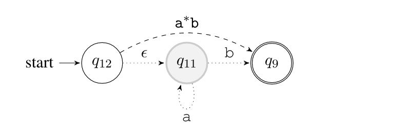

# A0LREe #

**A0LREe**: 0-reversible Automaton (**A<sub>0</sub>**) **L**earner and **R**egular **E**xpression **e**xtractor. Input of the program is a list of strings, output is a regular expression.


## Overview ##

**A0LREe** is a pipeline of three algorithms:

- 0-Reversible Learner: constructs a Finite-State Automaton (FSA) from the list of strings
- State-Elimination: extracts a regular expression from the FSA
- Nested Regular Expressions (work in progress): simplifies the regular expression during the extraction process.

This implementation only serves as a proof-of-concept and has some serious drawbacks. For a detailed description see the accompanying [paper](Learning_FSAs_and_REs_from_examples.pdf). For an illustration of the workflow, see below.


## Modules ##
* `automaton.py` - Automaton and Node classes, used by other modules
* `a0_learner.py` - Constructs an Automaton instance from input
* `re_parser.py` - Extracts a Regular Expression with the State Elimination Algorithm
* `nested_re.py` - NestedRE class, used to efficiently merge expressions during extraction (partially completed)
* `a0lree.py` - Provides user interface
 
## Requirements ##

- Python 3

The following Python packages a required for drawing graphs:
- graphviz
- PyQt5

both can be installed with pip.

## Usage ##

Mandatory argument:
* One of:
  * `-c`: read examples from stdin
    * seperator is space
  * `<filepath>` read examples from file (expected as **last** argument), file format:
    * each string on a seperate path
    * no seperator symbols
    * empty line means empty string should be accepted by the regular expression

Optional arguments:
* `-h`, `--help`: print help
* `-v`: draw graphs and print more info to STDOUT

Example:
```sh
$ ./a0lree.py -v examples.txt
```
or
```sh
$ ./a0lree.py -c b ab aab aaaab
>>> a*b 
```

## Workflow example ##

The file `example.txt` contains the strings `[b, ab, aab, aaaab]`. A0LREe does its work in the following steps.

- Constructs a Prefix Tree, an FSA which accepts exactly these four strings
<br />


- Merges the accepting nodes of the Prefix Tree
<br />

- Merges nodes with non-deterministic transitions. The resulting graph is a 0-reversible FSA (see paper for the definition): <br />

 
- The FSA is converted into a uniform FSA, which is required by the State-Elimination algorithm
<br />


- Iteratively eliminates nodes of the FSA, until only the initial final nodes are left
<br />


- The resulting graph has only one edge, and the label of this edge is the output of the program
<br />